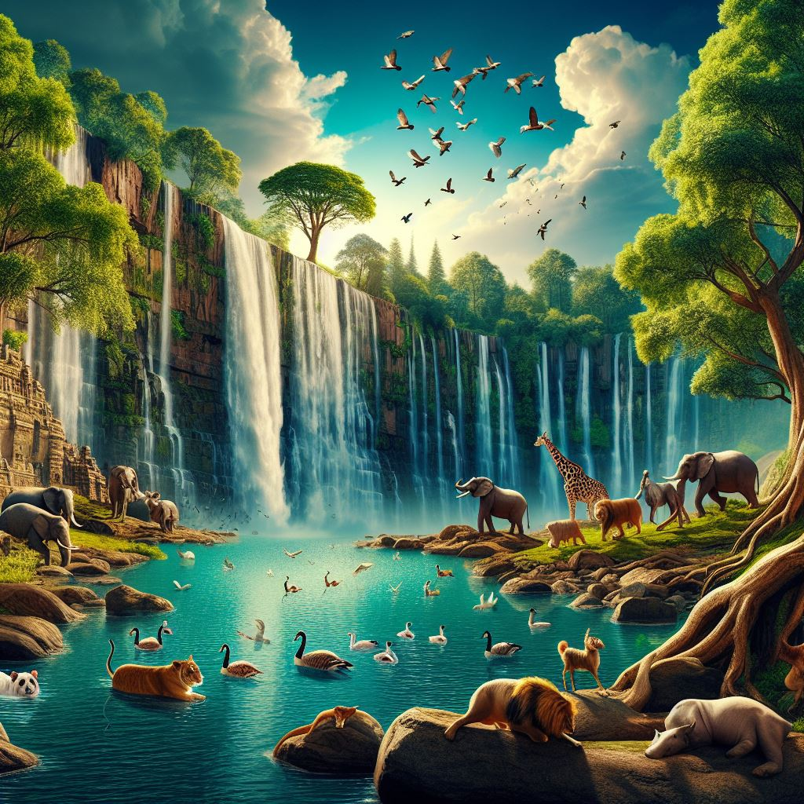

# Prompt Docs

```
Warning:

Github copilot prompts is included in the file. Github copilot prompts are excluded from project docs.
```

```
Write header with brand name that is Unfaithful - Nature Image Gallery ; the most right of the page have parts that are home, gallery,sign up. Also make fancy with css support.

-- Gemini
```

```
nature image with waterfall, animals and sky

-- Microsoft Ai
```

```
nature image in moon

-- Microsoft Ai
```

```
desert image with waterfall

-- Microsoft Ai
```

```
desert image with moon, lonely person

-- Microsoft Ai
```

```
green leaf as a nature image theme

-- Microsoft Ai
```

```
ocean image with moon, a pirate ship and a land

-- Microsoft Ai
```

```
river with a village

-- Microsoft Ai
```

```
write html code , use table tag ,3x3 with each item has image that is 300 x 400 pixels

-- Gemini
```

```
write a div that has 4 link

-- Gemini
```

```
Why should we protect nature?

explain item by item

-- Gemini
```

```
make search div and go back button horizontal


<div style="margin-top: 20px; margin-left: 20px;">
                    <!-- add seperator between links-->
                    <!-- change seperator span tag-->
                    <!-- make button active -->
                    <button type="button" class="btn btn-light">⬅️ Go Back</button>
                
                    <!-- make button active -->
                    <button type="button" class="btn btn-light active">User Images</button>
                    <input type="text" id="hover-text-field" style="display: none;">
                    <!-- bootstrap input field -->
                    <div class="input-group mb-3" style="width: 300px;">
                        <input type="text" class="form-control" placeholder="Search for images" aria-label="Search for images"
                            aria-describedby="button-addon2">
                        <button class="btn btn-outline-secondary" type="button" id="button-addon2">Search</button>
                    </div>
                </div>

-- Gemini
```

```
search div must be left of page but right of go back button


-- Gemini
```

```
make width of search div 100 px

-- Gemini
```

```
write css

<div>
    <div style="background-color: yellow; text-align: center; padding: 10px;">
      <h3>Advertisement</h3>
      <p>Check out our latest products and offers!</p>
      
      <br>
      <a href="https://example.com">Visit our website</a>
    </div>
  </div>

when hover image, change image

-- Gemini
```

```
write css

<div>
        <div style="background-color: yellow; text-align: center; padding: 10px;">
            <h3>Advertisement</h3>
            <p>Check out our latest products and offers!</p>
            
            <br>
            <a href="https://example.com">Visit our website</a>
        </div>
    </div>

when hover image, make image bigegr size

-- Gemini
```


```
<form action="#" method="post" style="margin-left: 22px; margin-right: 22px;  box-shadow: 1px 1px 1px 1px rgb(95, 229, 153);">
        <div class="container">
            <div class="row">
                <div class="col-md-4 offset-md-4">
                    <h1>Sign Up</h1>
                    <p>Please fill in this form to create an account.</p>
                    <br>
                    <label for="username"><b>Username</b></label>
                    <input type="text" placeholder="Enter Username" name="username" required>

                    <label for="password"><b>Password</b></label>
                    <input type="password" placeholder="Enter Password" name="password" required>

                    <!-- add show password button-->
                    <input type="checkbox" onclick="myFunction()">Show Password
                    
                    <br>
                    <br><br>
                    
                    
                    <button type="submit" class="registerbtn">Sign Up</button>
                </div>
            </div>
        </div>
    </form>


<script>
        function myFunction() {
            var x = document.getElementById("password");
            if (x.type === "password") {
                x.type = "text";
            } else {
                x.type = "password";
            }
        }
    </script>

show password is not work, fix it!

-- Gemini
```

```
make width of search div 100 px

-- Gemini
```


```
my header is position: fixed;
    top: 0;

but search div has a problem

It is not visible behind the header


<!DOCTYPE html>
<html lang="en">

<head>
    <!-- add css file   -->
    <link rel="stylesheet" href="style.css">
    <!-- add bootstrap 5.3 support -->
    <link href="https://cdn.jsdelivr.net/npm/bootstrap@5.3.3/dist/css/bootstrap.min.css" rel="stylesheet"
        integrity="sha384-QWTKZyjpPEjISv5WaRU9OFeRpok6YctnYmDr5pNlyT2bRjXh0JMhjY6hW+ALEwIH" crossorigin="anonymous">
    <meta charset="UTF-8">
    <meta name="viewport" content="width=device-width, initial-scale=1.0">
    <!-- add favicon -->
    <link rel="icon" href="favicon.ico" type="image/x-icon">
    <title>Unfaithful - Nature Image Gallery</title>

    <style>
        .image-container {
            display: flex;
            flex-wrap: wrap;
        }

        .image-item {
            width: 33.33%;
            /* Adjust for desired images per row */
            margin: 5px;
        }

        /* Add your CSS here */

        /* make header font lato */
        header {
            font-family: 'Lato', sans-serif;
        }

        body {
            font-family: 'Lato', sans-serif;
        }

        .btn:nth-child(4):hover+#hover-text-field {
            display: block;
            position: absolute;
            /* Position the text field next to the button */
            top: 0;
            /* Align top edge with button */
            left: 100%;
            /* Position it slightly to the right */
            margin-left: 5px;
            /* Add a small margin for better appearance */
        }

        #hover-text-field {
            /* Style the text field as desired */
            border: 1px solid #ccc;
            padding: 5px;
            background-color: #fff;
        }
    </style>
</head>

<body>
    <header>
        <h1 style="margin-left: 22px;">
            🌿Nature Images <span style="font-size: 15px;">by </span> <span
                style="color: rgb(255, 255, 255); background-color: rgb(194, 189, 189); border-radius: 5px; font-size: 15px;">
                Unfaithful </span>
        </h1>
        <nav style="margin-right: 22px;">

            <a href="#">Home</a>
            <a href="#" style="text-decoration: underline;">Gallery</a>
            <a href="#">Sign Up</a>
        </nav>
    </header>

    <!-- add blank -->
    <br>
    <br>
    <br>

    <!-- make each row has 5 image -->
    <!-- use main,section, aside,article tags, do not change contents-->
    <!-- add header and description for each image -->
    <main>
        <section>
            <article>
                <div style="display: flex; margin-top: 20px; margin-left: 20px;">
                    <button type="button" class="btn btn-light" style="margin-right: 10px;">⬅️ Go Back</button>

                    <div class="input-group" style="width: 300px; flex: none;">
                        <input type="text" class="form-control" placeholder="Search by users"
                            aria-label="Search for images" aria-describedby="button-addon2">
                        <button class="btn btn-outline-secondary" type="button" id="button-addon2">Search</button>
                    </div>

                    <button type="button" class="btn btn-light active" style="display: none;">User Images</button>
                    <input type="text" id="hover-text-field" style="display: none;">
                </div>


                <table>
                    <tr>
                        <td>
                            
                            <h2>Image 1</h2>
                            <p>Description for Image 1</p>
                        </td>
                        <td>
                            
                            <h2>Image 2</h2>
                            <p>Description for Image 2</p>
                        </td>
                        <td>
                            
                            <h2>Image 3</h2>
                            <p>Description for Image 3</p>
                        </td>
                        <td>
                            
                            <h2>Image 4</h2>
                            <p>Description for Image 4</p>
                        </td>
                        <td>
                            
                            <h2>Image 5</h2>
                            <p>Description for Image 5</p>
                        </td>
                    </tr>
                    <tr>
                        <td>
                            
                            <h2>Image 6</h2>
                            <p>Description for Image 6</p>
                        </td>
                        <td>
                            
                            <h2>Image 7</h2>
                            <p>Description for Image 7</p>
                        </td>
                        <td>
                            
                            <h2>Image 8</h2>
                            <p>Description for Image 8</p>
                        </td>
                        <td>
                            
                            <h2>Image 9</h2>
                            <p>Description for Image 9</p>
                        </td>
                        <td>
                            
                            <h2>Image 10</h2>
                            <p>Description for Image 10</p>
                        </td>
                    </tr>
                    <!-- Add more rows as needed -->
                </table>
            </article>
        </section>
        <aside>
            <!-- Add any additional content here -->
        </aside>
    </main>


    <!-- write footer has 2 links that are https://www.linkedin.com/in/gurkangokmen/, https://github.com/gurkangokmen/-->
    <!-- make fancy with css --> <!-- Note: I cut code from here generated from github copilot and paste css file-->
    <!-- add some blank between main and footer-->
    <br>
    <br>
    <br>
    <br>

    <footer>
        <a href="https://www.linkedin.com/in/gurkangokmen/">LinkedIn</a>
        <a href="https://github.com/gurkangokmen/">GitHub</a>
    </footer>


    <script src="https://cdn.jsdelivr.net/npm/bootstrap@5.3.0/dist/js/bootstrap.bundle.min.js"
        integrity="sha384-kYFJZUOCAYQDnYiBs3IxNsrqcjD4COu7DzgPArNzxBA4qT5zXgAoUPe4EJUF0jCW"
        crossorigin="anonymous"></script>

</body>

</html>


body{
    margin: 0;
    padding: 0;
    font-family: Arial, sans-serif;
    background-color: white;
  }

  /* Style for the header */

header {
    display: flex;
    justify-content: space-between;
    align-items: center;
    width: 100%;
    background-color: #c3e6cb;
    box-shadow: 0 3px 0 0 rgba(0, 0, 0, 0.489);
    position: fixed;
    top: 0;
    margin: 0;
    height: 55px;
    overflow: hidden;
  }

  /* Style for the brand name */

  
header h1 {
    font-family: 'Dancing Script', cursive; 
    font-size: 2rem;
    margin: 0;
}

  /* Style for the navigation links */
  header nav {
    display: flex;
    gap: 1rem;
  }

  header nav a {
    text-decoration: none;
    color: #333;
    font-weight: bold;
  }

  header nav a:hover {
    color: #000;
  }

  table {
    border-collapse: collapse; /* Remove borders between cells */
  }
  td {
    width: 300px; /* Set cell width to 300px */
    height: 400px; /* Set cell height to 400px */
    text-align: center; /* Center images horizontally */
  }
  img {
    max-width: 100%; /* Scale images to fit within cell */
    max-height: 100%; /* Scale images to fit within cell */
  }


  /* make each row cover %100 of row */
  table {
    width: 100%;
}

/* make img border light green and soft corner*/
table img {
    border: 5px solid #c3e6cb;
    border-radius: 10px;
    width: 85%;
    height: auto;
}


footer {
    display: flex;
    justify-content: center;
    align-items: center;
    background-color: #d0f5d8;
    padding: 0px;
    margin-left: 0;
    position: fixed;
    bottom: 0; 
    width: 100%;
    box-shadow: 0 0 3px 0 rgba(0, 0, 0, 0.489);
}

footer a {
    margin: 3px;
    text-decoration: none;
    color: #000;
    font-size: 15px;
}

footer a:hover {
    color: #007bff;
}

/* Target the image element within the advertisement div */
.advertisement img {
    transition: transform 0.3s ease-in-out; /* Smooth transition effect */
  }
  
  /* Style the image on hover */
  /* add red borber, example code: border: 5px solid #c3e6cb; */
.advertisement img:hover {
    transform: scale(1.1); /* Increase image size by 20% */
    border: 5px solid red; /* Set border color to red */
}


-- Gemini
```

```
your code does not work, but when i remove input-group it works but it isn't horizontal

-- Gemini
```

